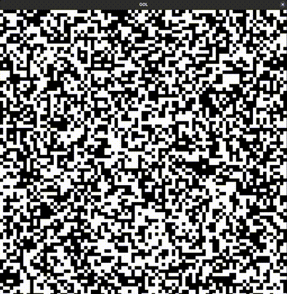

# Conway's Game of Life

A simple implementation of **Conway's Game of Life** written in **C** using **Raylib**.

## Preview



## Controls

| Input              | Action                  |
| ------------------ | ----------------------- |
| Left Mouse Button  | Draw live cells         |
| Right Mouse Button | Erase cells             |
| Space              | Play / Pause simulation |
| G                  | Enable / Disable grid   |
| R                  | Randomize grid          |
| C                  | Clear the grid          |

## Requirements

* GCC
* Make
* Raylib
* pkg-config

### Fedora

```bash
sudo dnf install raylib raylib-devel pkgconf-pkg-config
```

### Arch Linux

```bash
sudo pacman -S raylib pkgconf
```

For other operating systems, please install Raylib using your platform's recommended method before building the project.

## Build

Clone the repository:

```bash
git clone https://github.com/sumukhvhegde/game-of-life.git
```

Move into the project directory:

```bash
cd game-of-life
```

Compile the project:

```bash
make
```

Run the application:

```bash
make run
```